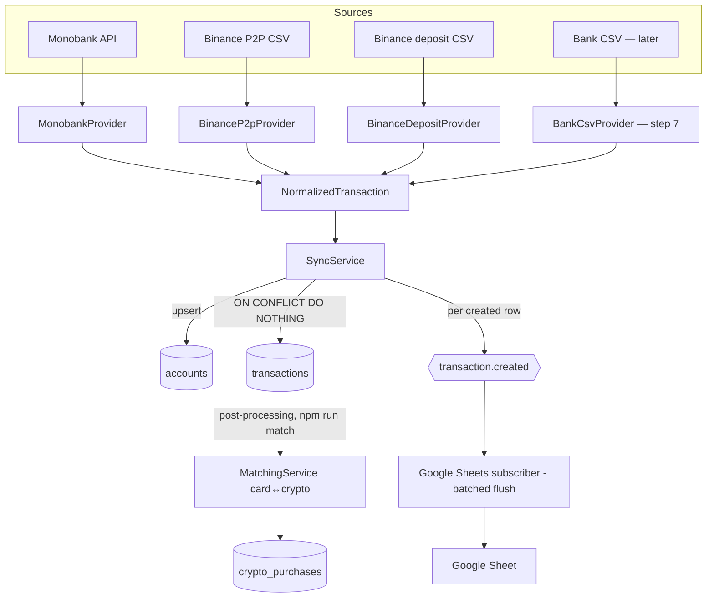

# Architecture Overview

Layered, source-agnostic. The core (normalize/sync) knows nothing about specific sources — a new source is added outside as a provider. → [[Invariants]] #3, [[Providers]]

## Data flow

## Layers
1. **Providers** (`src/providers/*`) — fetch + map raw fields into `NormalizedTransaction`. They know their own source; nothing else. → [[Providers]]
2. **Normalize** (`src/core/normalize`) — canonical type plus clean helpers (`buildExternalId`, `money`, `toNormalized`). Source-agnostic.
3. **Sync** (`src/sync`) — watermark → `provider.fetch()` → upsert accounts → idempotent insert → event. → [[Sync Engine]]
4. **Events + Subscribers** (`src/events`, `src/subscribers`) — side effects only through `transaction.created`. → [[Events & Export]]
5. **Persistence** (`src/modules/*`, TypeORM) — entities + migrations. → [[Data Model]]
6. **Composition root** (`src/app.module.ts`) + entrypoint `src/sync.command.ts` (`npm run sync`).

## Key technical facts
- NestJS 11, TypeORM **1.0**, PostgreSQL 16 (`gen_random_uuid()` in the core, without extension).
- DB connection — single `DATABASE_URL`. `synchronize:false`, schema changes only through migrations.
- Secrets — through `.env` (`MONOBANK_TOKEN`, Google service-account). → [[Invariants]]
