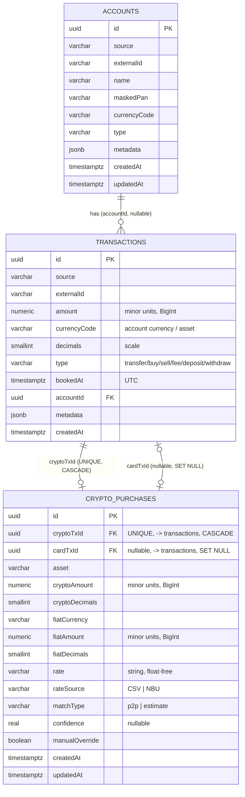

# Data Model

Schema through TypeORM migrations (`synchronize:false`). Money — `numeric(38,0)` ↔ `BigInt`
(see [[Invariants]] #1).

## ERD

## `transactions`
- **PK** `id` uuid (`gen_random_uuid()`).
- **`UNIQUE(source, externalId)`** — dedupe/idempotency key ([[Invariants]] #4).
- `amount numeric(38,0)` + `currencyCode` + `decimals` — self-contained amount.
  `numeric(38,0)` was chosen so crypto with high precision would not overflow `bigint`.
- `type` — flat enum (`TransactionType`); P2P markers live in `metadata`, no separate
  type is introduced (simplicity). → [[Decision Log]]
- `bookedAt timestamptz` (UTC). Indexes: `(bookedAt)`, `(accountId, bookedAt)`.
- `accountId` — FK → `accounts.id`, `ON DELETE SET NULL`, nullable.
- `metadata jsonb` — extension point: Monobank `mcc`, `operationAmount`,
  `operationCurrencyCode`, counterparty; future crypto `tradeRef`/`groupId` for linking
  trade legs (so FIFO PnL stays possible). → [[Card↔Crypto Matching]]

## `accounts`
- **PK** `id` uuid; **`UNIQUE(source, externalId)`**.
- Display fields: `name`, `maskedPan`, `currencyCode`, `type` — "card ••1234 / UAH".
- Upserted from sync (enriched on every run). → [[Sync Engine]]

## `crypto_purchases` (step 5)
- **PK** `id` uuid. Result of the card↔crypto matching post-processing stage — written
  only by `MatchingService` (`npm run match`); providers and `SyncService` do not know
  about this table. → [[Invariants]] #5, [[Card↔Crypto Matching]]
- **`cryptoTxId`** — FK → `transactions.id`, `ON DELETE CASCADE`, **`UNIQUE`**:
  at most one `CryptoPurchase` per crypto inflow (one leg = one record).
- **`cardTxId`** — FK → `transactions.id`, `ON DELETE SET NULL`, nullable: the card
  debit that financed the purchase, if a match was found; `null` = unmatched. Index
  on `cardTxId`.
- `asset` + `cryptoAmount numeric(38,0)`↔`BigInt` + `cryptoDecimals` — crypto side
  (the same leg as `cryptoTxId`).
- `fiatCurrency` + `fiatAmount numeric(38,0)`↔`BigInt` + `fiatDecimals` — fiat
  cost basis (from `transactions.metadata` on the crypto leg: `fiatAmountMinor`/
  `fiatCurrencyCode`/`fiatDecimals`).
- `rate varchar` — exchange rate, a **string** (float-free), copied as-is from the source.
- `rateSource` — `'CSV'` (P2P, step 5) or `'NBU'` (estimate, step 6).
- `matchType` — `'p2p'` (step 5) or `'estimate'` (step 6).
- `confidence real, nullable` — match quality in `[0,1]`; `null` when there is no candidate.
- `manualOverride boolean default false` — when `true`, upsert by `cryptoTxId`
  (`ON CONFLICT ... DO UPDATE ... WHERE "manualOverride" = false`) no longer touches
  this row — the user’s manual decision is final until explicitly changed.

## Migrations
1. `1719660000000-CreateTransactions` — `transactions` table, UNIQUE, index.
2. `1719660000001-AddAccounts` — `accounts` table, `transactions.accountId` FK+index,
   **backfill** existing rows from `metadata->>'accountId'`.
3. `1719660000002-AddCryptoPurchases` — `crypto_purchases` table, FK `cryptoTxId`
   (CASCADE, UNIQUE) + `cardTxId` (SET NULL), index on `cardTxId`.

## Planned entities
- Estimate extension `CryptoPurchase` for unmatched deposits (NBU rate) — step 6.
  → [[Card↔Crypto Matching]]
